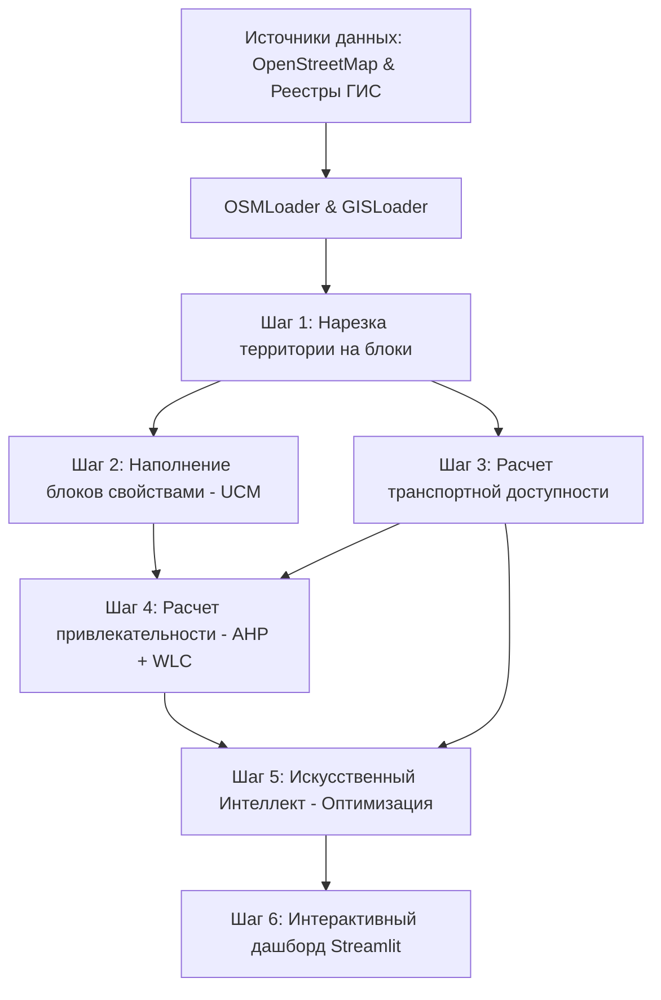

# 🗺️ Руководство по проекту: Leningrad Tourism Model (Предиктивная модель мастер-планирования)

Этот документ простым языком, по шагам объясняет, как работает предиктивная модель развития туризма в Ленинградской области (на примере пилотных Пушкинского и Гатчинского районов). 

Если вы видите этот проект впервые, данное руководство поможет вам понять, **откуда берутся данные, как компьютер производит расчеты и какое практическое решение выдает система.**

---

## 🌟 Общая идея: Что делает проект?

Представьте, что перед администрацией региона или инвестором стоит задача: развивать туризм на большой территории. Где построить гостиничные хабы? Где проложить экологические тропы? Где открыть новые музеи и рестораны, чтобы они не пустовали, дополняли друг друга и не вредили экологии?

Обычно такие решения принимаются экспертами «вручную». Наш проект делает это **алгоритмически**. 

Система поддержки принятия решений (DSS):
1. **Делит территорию** на реалистичные кварталы (блоки).
2. **Собирает информацию** обо всем, что находится внутри и вокруг каждого блока (природа, дороги, памятники, кафе).
3. **Оценивает потенциал** каждого блока по методу анализа иерархий (AHP) для трех типов использования (Хаб, Точка притяжения, Маршрут).
4. **Запускает алгоритм оптимизации (Имитацию отжига)**, который, как в игре в тетрис, находит оптимальную комбинацию использования земель для всей карты с учетом транспортной доступности, соседства и экологических ограничений.
5. **Визуализирует результаты** на интерактивной карте, рекомендуя лучший сценарий развития.

---

## 🔄 Схема работы (Пайплайн)

Ниже представлена общая схема прохождения данных через систему (от сбора до визуализации):



---

## 📂 Главные файлы проекта

Для удобства навигации по коду, вот ссылки на ключевые компоненты системы:
*   [main.py](file:///C:/leningrad_tourism_model/main.py) — главный дирижер (запускает по очереди скачивание, нарезку, оценку и оптимизацию).
*   [app.py](file:///C:/leningrad_tourism_model/app.py) — визуальный веб-интерфейс, который вы видите в браузере.
*   [configs/ahp_constants.json](file:///C:/leningrad_tourism_model/configs/ahp_constants.json) — файл настроек, где хранятся веса для разных сценариев планирования.
*   [src/etl/osm_loader.py](file:///C:/leningrad_tourism_model/src/etl/osm_loader.py) — отвечает за скачивание географических данных из открытой карты мира (OpenStreetMap).
*   [src/etl/gis_loader.py](file:///C:/leningrad_tourism_model/src/etl/gis_loader.py) — загружает официальные государственные реестры (памятники культуры, заповедники).
*   [src/generation/topological_generator.py](file:///C:/leningrad_tourism_model/src/generation/topological_generator.py) — нарезает карту на блоки.
*   [src/generation/ucm_builder.py](file:///C:/leningrad_tourism_model/src/generation/ucm_builder.py) — собирает статистику внутри каждого блока.
*   [src/analysis/ahp.py](file:///C:/leningrad_tourism_model/src/analysis/ahp.py) — математически оценивает потенциал блоков.
*   [src/analysis/optimizer.py](file:///C:/leningrad_tourism_model/src/analysis/optimizer.py) — алгоритм оптимизации (имитация отжига), принимающий финальные решения.

---

## 📖 Пошаговый разбор: Как это работает?

### Шаг 1. Сбор данных (Откуда всё берется)
Работа начинается с загрузки пространственной информации. Программа обращается к двум основным источникам:
1. **OpenStreetMap (OSM)** — всемирная открытая карта. Через класс [OSMLoader](file:///C:/leningrad_tourism_model/src/etl/osm_loader.py#L10) мы скачиваем границы районов, дороги, реки, леса, а также точки интереса (POI): кафе, рестораны, отели, кемпинги, остановки транспорта и вокзалы.
2. **Локальные ГИС-файлы** — через класс [GISLoader](file:///C:/leningrad_tourism_model/src/etl/gis_loader.py#L8) загружаются файлы `okn.geojson` (Объекты культурного наследия / памятники архитектуры) и `oopt.geojson` (Особо охраняемые природные территории / заповедники).

> **Для чего это нужно:** Без детальной географической основы модель не сможет понять, где находятся горы, где леса, а где уже есть инфраструктура.

---

### Шаг 2. Разрезание карты на блоки (Топологическая дискретизация)
**Где это происходит:** [TopologicalGenerator](file:///C:/leningrad_tourism_model/src/generation/topological_generator.py#L8) в файле [topological_generator.py](file:///C:/leningrad_tourism_model/src/generation/topological_generator.py).

Компьютер не может анализировать карту как сплошную картинку. Её нужно разделить на элементы. Вместо использования скучной квадратной сетки (которая режет дороги и здания пополам), система делит карту на **естественные городские и природные блоки (полигоны)**.

1. Границами для нарезки служат **реальные физические барьеры**: автомобильные дороги, железные дороги и реки.
2. Для расчетов используется специализированная библиотека `BlocksNet` и алгоритмы триангуляции/диаграмм Вороного.
3. **Умный переменный масштаб (Variable Scale)**:
   * Около крупных транспортно-пересадочных узлов (ТПУ / ж/д вокзалов) в радиусе 3 км программа оставляет мелкие улочки. Это позволяет получить детальные маленькие блоки размером **500 метров – 1 километр** (так как в этих зонах туристы ходят пешком и нужна высокая точность).
   * В лесах и полях мелкие дороги игнорируются. Блоки получаются крупными — **до 5 километров**. Это экономит вычислительные ресурсы компьютера.
4. Мелкий геометрический мусор (осколки площадью менее 500 кв.м) автоматически отсеивается.

> **Что рассчитывается на этом шаге:** Границы каждого блока (`geometry`), уникальный идентификатор (`block_id`) и расстояние от центра блока до ближайшего вокзала/станции (`dist_to_hubs`).

---

### Шаг 3. Заполнение блоков информацией (Семантическое наполнение)
**Где это происходит:** [UCMBuilder](file:///C:/leningrad_tourism_model/src/generation/ucm_builder.py#L4) в файле [ucm_builder.py](file:///C:/leningrad_tourism_model/src/generation/ucm_builder.py).

Теперь у нас есть сеть пустых блоков. Алгоритм накладывает на них наши базы данных и считает, что попало внутрь каждого полигона (метод Spatial Join):
* **Культура:** количество памятников культуры (`okn_count`).
* **Развлечения и услуги:** количество точек притяжения (`poi_count`), кафе/ресторанов (`food_count`).
* **Жилье:** количество отелей, гостиниц, кемпингов (`accommodation_count`).
* **Транспорт:** количество автобусных остановок и платформ (`transport_count`).
* **Природа:** 
  * Доля покрытия блока лесом (`forest_share` от 0.0 до 1.0).
  * Доля покрытия заповедником (`oopt_share` от 0.0 до 1.0).
  * Заболоченность территории (`swamp_share` от 0.0 до 1.0) — *ограничивающий фактор (строить на болоте нельзя!)*.
  * Плотность рек и озер (`water_density`).
* **Землепользование:** Доминирующее использование земли по данным карты (`dominant_landuse`).

> **Для чего это нужно:** На выходе мы получаем цифровую модель территории (UCM — Urban Context Model), где каждый кусочек земли охарактеризован числами.

---

### Шаг 4. Расчет матрицы транспортной доступности
**Где это происходит:** функция [generate_ucm](file:///C:/leningrad_tourism_model/main.py#L62) в файле [main.py](file:///C:/leningrad_tourism_model/main.py) с использованием библиотеки `iduedu`.

Модель должна понимать, как блоки связаны между собой транспортной сетью.
1. Программа строит граф дорог региона.
2. Для каждой пары блоков (например, от блока №5 до блока №120) рассчитывается **минимальное время в пути на автомобиле** в минутах.
3. Результат сохраняется в виде большой таблицы (матрицы) в формате Parquet (`accessibility_matrix.parquet`).
*Если дорожный граф не удается загрузить из-за сбоев сети, программа автоматически рассчитывает расстояние напрямую (по Евклиду) и переводит его в условное время.*

> **Для чего это нужно:** Чтобы алгоритм оптимизации понимал, например, находится ли планируемый отель в 5 минутах езды от музея или в часе езды по глухим лесам.

---

### Шаг 5. Расчет привлекательности блоков (Сценарное взвешивание AHP)
**Где это происходит:** функция [run_stage2_ahp](file:///C:/leningrad_tourism_model/src/analysis/ahp.py#L65) в файле [ahp.py](file:///C:/leningrad_tourism_model/src/analysis/ahp.py).

Мы хотим оценить, насколько каждый блок пригоден под одну из трех туристических функций (**ТОКТ** — Туристско-Оздоровительный Каркас Территории):
1. **Опорные центры (Хабы)** — места для размещения гостиниц, вокзалов, ресторанов.
2. **Локальные точки притяжения** — музеи, усадьбы, смотровые площадки, памятники.
3. **Линейные элементы (Маршруты)** — экологические тропы, велопешеходные дорожки, кемпинги.

Для этого используется **Метод Анализа Иерархий (AHP)** Томаса Саати и взвешенное сложение:
* Все показатели блоков приводятся к единой шкале от 0 до 1 (нормализация MinMax).
* **Ограничивающие факторы** инвертируются: например, если в блоке высокая заболоченность (`swamp_share`), то её полезность уменьшается до `1.0 - swamp_share` (чем больше болота, тем ниже привлекательность для застройки).
* Каждому фактору присваивается свой «вес» (важность) на основе экспертных оценок (настройки лежат в [configs/ahp_constants.json](file:///C:/leningrad_tourism_model/configs/ahp_constants.json)).
* Расчет производится в трех **сценариях развития**:
  * 🌿 **Экоцентризм** (важен экологический туризм). Для Маршрутов максимальный вес дается лесам (0.30) и заповедникам (0.20).
  * 🏰 **Историко-центризм** (важно культурное наследие). Для Точек притяжения главный приоритет — ОКН/памятники (0.30) и достопримечательности (0.25).
  * 🚉 **Инфраструктурный** (важна транспортная доступность). Для Хабов ключевой фактор — транспортная доступность (0.60).

> **Что рассчитывается на этом шаге:** Каждый блок получает 9 оценок пригодности ($S_{ik}$) — по 3 функции для каждого из 3 сценариев. Значение $S_{ik}$ лежит в пределах от 0.0 (абсолютно непригоден) до 1.0 (идеальное место).

---

### Шаг 6. Глобальная пространственная оптимизация (ИИ принимает решения)
**Где это происходит:** класс [SimulatedAnnealingOptimizer](file:///C:/leningrad_tourism_model/src/analysis/optimizer.py#L28) и функция [run_optimization](file:///C:/leningrad_tourism_model/src/analysis/optimizer.py#L152) в файле [optimizer.py](file:///C:/leningrad_tourism_model/src/analysis/optimizer.py).

Если просто отдать под Хабы все блоки, у которых оценка привлекательности высокая, мы получим хаотичную застройку. Нам нужно сбалансированное решение. Для разрешения этого пространственного конфликта запускается алгоритм **имитации отжига (Simulated Annealing)**.

Алгоритм максимизирует **целевую функцию (энергию системы)**, которая складывается из трех составляющих:
1. **Индивидуальная пригодность ($S_{ik}$)**: Блокам стараются назначить те функции, под которые они больше всего подходят физически.
2. **Пространственная синергия (Соседство)**: Блоки влияют друг на друга. Синергия рассчитывается с использованием матрицы времени в пути (из Шага 4).
   * *Пример положительной синергии (+1.0)*: Наличие Хаба (отеля) рядом с Точкой притяжения (музеем) — это очень хорошо для туриста.
   * *Пример отрицательной синергии (-0.5)*: Размещение двух Хабов прямо вплотную друг к другу нежелательно, так как они будут конкурировать.
3. **Экологическая емкость (Carrying Capacity)**:
   * У каждой функции есть базовая плотность нагрузки (Хабы — 2000 чел/га, Точки притяжения — 500 чел/га, Маршруты — 100 чел/га).
   * Если на маленький зеленый блок назначить функцию Хаба с высокой емкостью, это может превысить порог устойчивости природы (1000 чел/га). За такое превышение алгоритм начисляет **штраф**, снижающий общие очки системы.

**Как работает сам отжиг:**
1. Сначала блоки получают функции «жадным» образом (где выше балл пригодности).
2. Алгоритм совершает 50 000 итераций. На каждом шаге он случайно меняет функцию у случайного блока.
3. Если замена увеличивает общую сумму баллов (улучшает синергию или убирает штрафы за перегрузку емкости), замена принимается.
4. На ранних этапах («высокая температура» алгоритма) система может принимать даже ухудшающие решения, чтобы выйти из локальных тупиков. К концу («остывание») принимаются только улучшающие шаги.

> **Что рассчитывается на этом шаге:** Каждому блоку назначается один финальный тип использования (**Target Land Use**) для каждого сценария, а также рассчитывается **Capacity (обслуживающая емкость)** — сколько туристов (человек) этот блок сможет комфортно принять с учетом его площади и пригодности.

---

### Шаг 7. Интерактивная визуализация (Дашборд Streamlit)
**Где это происходит:** [app.py](file:///C:/leningrad_tourism_model/app.py).

Результаты оптимизации сохраняются в файл `ucm_blocks_optimized.geojson`. Веб-интерфейс на Streamlit читает этот файл и строит красивую карту:
* **Цвета блоков (ТОКТ):**
  * 🟣 **Синий/Фиолетовый** — Опорные центры (Хабы).
  * 🟠 **Янтарный/Оранжевый** — Локальные точки притяжения.
  * 🟢 **Зеленый** — Линейные элементы (Маршруты).
* **Автоматическая рекомендация сценария:**
  Система вычисляет интегральный балл для каждого сценария:
  $$\text{Интегральный балл} = \text{Средняя пригодность выбранных типов} \times \text{Общая емкость размещения (Capacity)}$$
  Сценарий с наибольшим баллом подсвечивается золотым кубком как **🏆 РЕКОМЕНДУЕМЫЙ**.
* **Теплокарта «Приоритет развития»:**
  Блоки ранжируются по уровням приоритета (Высокий / Средний / Низкий) на основе их баллов $S_{ik}$. Это помогает инвесторам понять, какие участки следует осваивать в первую очередь.
* **Всплывающие окна (Popups):**
  Кликнув на любой блок на карте, пользователь видит:
  * Предписанный тип использования (Target Land Use).
  * Ожидаемую емкость обслуживания (Capacity) в людях.
  * Текущую инфраструктуру (сколько кафе, отелей, остановок в нем есть сейчас).
  * Значения пригодности по всем альтернативным типам ($S_{ik}$).
  * Расстояние до ближайшей железнодорожной станции.
  * Физические параметры (доля лесов, болот).

---

## 🛠️ Как запустить и протестировать модель?

Если вы хотите запустить расчеты с нуля:
1. **Настроить веса (опционально):** Откройте файл [configs/ahp_constants.json](file:///C:/leningrad_tourism_model/configs/ahp_constants.json) и поменяйте веса для факторов, если хотите проверить другую гипотезу планирования.
2. **Запустить расчеты:** Откройте терминал в папке проекта и выполните:
   ```bash
   python main.py
   ```
   *Скрипт скачает свежие данные из OSM, нарежет блоки, посчитает транспортную матрицу, проведет AHP-анализ и оптимизацию методом имитации отжига. Это может занять около 10-15 минут.*
3. **Запустить дашборд:** Выполните команду:
   ```bash
   streamlit run app.py
   ```
   В браузере откроется интерактивная карта с результатами.

---
*Документ подготовлен для команды проекта Leningrad Tourism Model. Использование математических моделей BlocksNet обеспечивает научную обоснованность и экологическую безопасность принимаемых решений в сфере туризма.*
